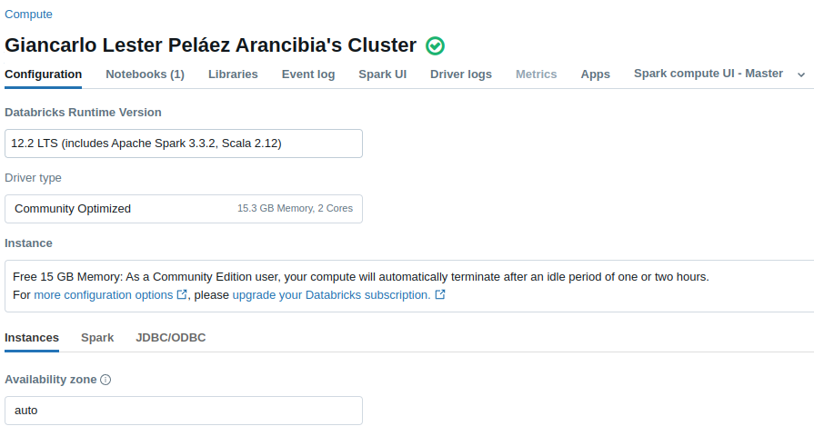
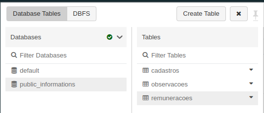
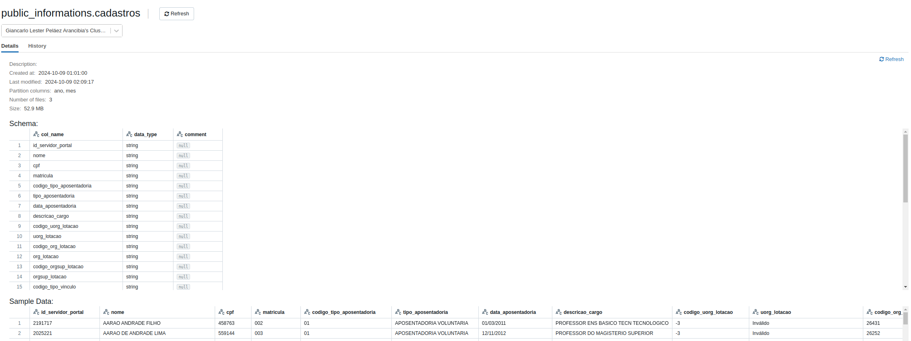
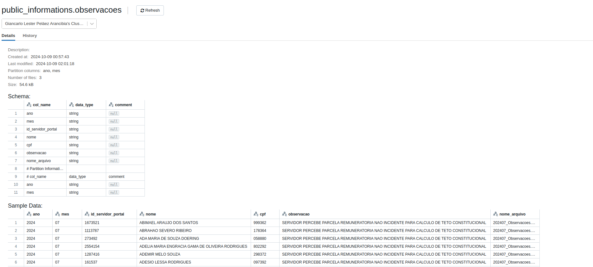
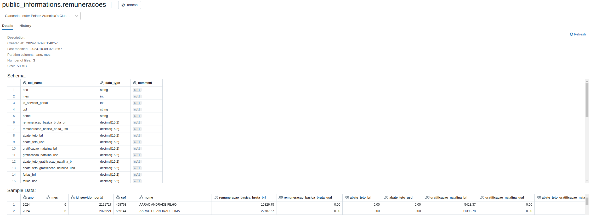

# Teste Técnico - Analytics Engineer & Data Engineer

## Requisitos

Cluster padrão da Databricks Community

## Instruções de Execução

- Importe o script Python `Teste_tecnico_PicPay.py` ou o notebook `Teste_tecnico_PicPay.ipynb` para o workspace do Databricks.
- Execute o script em um cluster padrão da versão Community do Databricks ou em outro ambiente que suporte PySpark, com acesso ao DBFS e Delta Lake.

## Resultados finais

Tabelas de `cadastros`, `observacoes` e `remuneração` particionadas pelo `ano` e `mês`.

Tabelas na UI do Databricks

Tabela de Cadastro

Tabela de Observações

Tabela de Remunerações

O código para a carga incremental e periódica das estatísticas descritivas das tabelas está presente no Jupyter Notebook.
